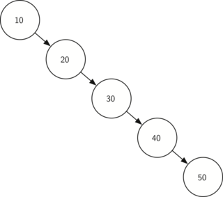

# Бинарное дерево поиска

В этой задача напишем свой [словарь](https://docs.python.org/3/tutorial/datastructures.html#dictionaries), более известный как `std::map`

---

*BST* – структура данных, которая выполняет операции поиска, вставки, удаления **в среднем** за O(Log n).

**Обладает следующими свойствами:**
- Максимум 2 ребёнка (бинарное дерево).
- Левый ребёнок меньше текущего.
- Правый ребёнок больше текущему.

За счёт двух последних свойств может применяться [бинарный поиск](https://agorinenko.github.io/data-structures-and-algorithms/tutorial/binary_search.html)

У каждого узла есть ключ (`Key`) по-которому происходит поиск и значение (`Value`), которое хранится в структуре.

Основные операции: 
- Вставка элемента: `void insert(const std::pair<const Key, Value>&)`
- Удаление элемента: `void erase(const Key&)`
- Поиск элемента: `bool find(const Key&)`

### insert

На вход принимает `const std::pair<const Key, Value>`

См. [std::pair](https://en.cppreference.com/w/cpp/utility/pair)

Обратите внимание, что первый элемент в pair `const Key`, а не просто `Key`!

Алгоритм можно разбить на три шага:
1) Найти позицию для вставки бинарным поиском
2) Создать новый узел с вставляемыми данными
3) Связать новый узел с узлом из пункта 1

Если данный ключ уже есть в дереве - перезаписываем данные.

### erase
На вход принимает ключ, по которому нужно найти узел для удаления.

Алгоритм можно разбить на три шага:
1) Найти родителя удаляемого узла
2) Поместить на место удаляемого узла его левого или правого сына. Если детей нет - skip.
3) Удалить узел

### find
На вход принимает ключ, по которому нужно найти узел.

Возвращаем bool: `true`, если значение есть, `false` - если нет.

Алгоритм можно описать так:
1) Если текущий корень == `nullptr` - возвращаем `false`.
2) Если искомый ключ меньше текущего - идём влево.
3) Если искомый ключ больше текущего - идём вправо.
4) Если искомый ключ равен текущему - возвращаем `true`.

## Словарь в `std`

См. [std::map](https://en.cppreference.com/w/cpp/container/map)

### Red-Black Tree

Стоит отметить, что сложность операций будет O(log n) **в среднем**. Однако, если вставлять отсортированные элементы, дерево может выстраиваться в `лесенку`:   

В таком случае, чтобы все операции превратяться в `O(N)`.

Чтобы этого избежать есть `сбалансированные деревья поиска` - дерево, в которых высоты любого левого и правого поддерева отличаются не более чем на 1. 

Путём дополнительных операций `балансировки`, достигается `O(log n)` во всех случаях.

Именно эти деревья реализованы в `std::map` и `std::set`.

См. [std::set](https://en.cppreference.com/w/cpp/container/set)

## Задание

Реализуйте [словарь](map.hpp) с помощью бинарного дерева поиска.

### Указания к реализации

Во всех операциях используется поиск. Реализайте приватный метод `find`, который будет возвращать указатель на искомый узел.

В деревьях применяются итераторы. Эффективно реализовать их для дерева - хорошая задача на интервью.

В публичном API не должно быть класса `Node`! Спрячьте их за итераторами.

`Compare` - это функция, которая возвращает true, если первый элемент меньше второго. В std::map пользователь может задать свою собственную функцию сравнения объектов.

Пользовать нужно именно объектом **`Compare`**: `if (Compare(Key1, Key2)){...}`
## References
- [BST iterators](https://stackoverflow.com/questions/4581576/implementing-an-iterator-over-a-binary-search-tree)